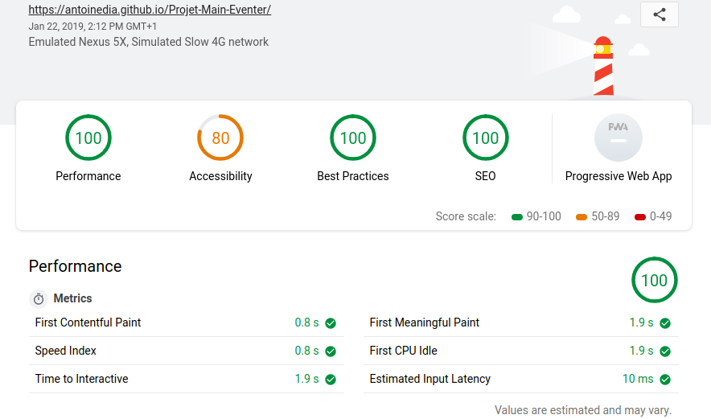

# Projet Main Eventer

## Notre équipe travaille sur l'intégration d'une maquette en HTML/CSS

(ouvrir les liens dans un nouvel onglet, [target="_blank"] ne fontionant pas sur GitHub)

Maquette : https://bit.ly/2W7jRj4

Repo des consiges et assets : https://bit.ly/2FVrBPk

Lien de la maquette intégrée : https://bit.ly/2MkOInV

Membres de l'équipe

- [**Teddy**](https://github.com/Elleonors): Partie "About" et "Team" || Customer relationship
- [**Guy Djendo**](https://github.com/Ho-Be-One): Partie "Events" et "Contact"
- [**Antoine**](https://github.com/AntoineDia) : Partie "Header" et "Footer"

Statut : Finalisations finales

  

*le score d'accessibilité étant du à la sélection de couleur du client*
